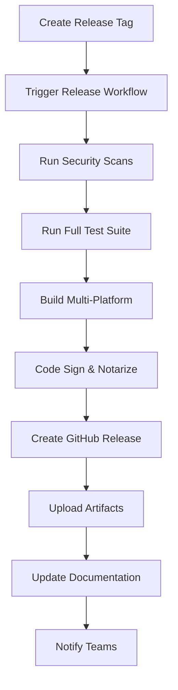

# NotebookMLX Release Management Strategy

## Overview

This document outlines the comprehensive release management strategy for NotebookMLX, covering versioning, branching, quality gates, and deployment processes.

## Versioning Strategy

### Semantic Versioning (SemVer)

NotebookMLX follows [Semantic Versioning 2.0.0](https://semver.org/):

**Format:** `MAJOR.MINOR.PATCH[-PRERELEASE][+BUILD]`

- **MAJOR:** Breaking changes that require user intervention
- **MINOR:** New features that are backward compatible
- **PATCH:** Bug fixes and minor improvements
- **PRERELEASE:** Alpha, beta, or release candidate indicators
- **BUILD:** Build metadata (optional)

### Version Examples

```
v1.0.0          # Stable release
v1.1.0          # Minor feature addition
v1.0.1          # Bug fix
v2.0.0          # Breaking changes
v1.1.0-beta.1   # Beta release
v1.1.0-alpha.20240101   # Alpha with timestamp
```

### Version Increment Guidelines

| Change Type | Version Bump | Examples |
|-------------|--------------|----------|
| Bug fixes | PATCH | Security patches, UI fixes |
| New features | MINOR | New TTS models, UI improvements |
| Breaking changes | MAJOR | API changes, MLX model incompatibilities |
| Security fixes | PATCH | Usually patch, MAJOR if breaking |

## Release Types

### 1. Stable Releases (Production)

**Frequency:** Monthly or feature-driven  
**Branch:** `main`  
**Quality Gates:** All tests pass, security scan, code signing  
**Distribution:** GitHub Releases, auto-update system

**Process:**
1. Feature freeze 1 week before release
2. Release candidate testing
3. Security and performance validation
4. Code signing and notarization
5. Release notes and documentation
6. Staged rollout to users

### 2. Beta Releases (Preview)

**Frequency:** Bi-weekly  
**Branch:** `develop` or feature branches  
**Quality Gates:** Core tests pass, basic security scan  
**Distribution:** GitHub Releases (pre-release)

**Purpose:**
- Early feedback from power users
- Testing new features before stable release
- Performance and compatibility validation

### 3. Alpha Releases (Development)

**Frequency:** Weekly or on-demand  
**Branch:** Feature branches  
**Quality Gates:** Build succeeds, smoke tests pass  
**Distribution:** Internal distribution only

**Purpose:**
- Developer testing
- Early integration testing
- Continuous integration validation

## Branching Strategy

### Git Flow Model

```
main (production)
├── develop (integration)
├── feature/new-tts-model
├── feature/ui-improvements
├── hotfix/security-patch
└── release/v1.1.0
```

### Branch Types

1. **`main`** - Production-ready code
   - Only accepts merges from `release/*` and `hotfix/*`
   - All commits are tagged releases
   - Protected branch with required reviews

2. **`develop`** - Integration branch
   - Latest development changes
   - Feature branches merge here first
   - Continuous integration testing

3. **`feature/*`** - New features
   - Branch from `develop`
   - Merge back to `develop` via PR
   - Deleted after merge

4. **`release/*`** - Release preparation
   - Branch from `develop`
   - Bug fixes and release preparation only
   - Merge to both `main` and `develop`

5. **`hotfix/*`** - Production fixes
   - Branch from `main`
   - Critical fixes only
   - Merge to both `main` and `develop`

## Quality Gates

### Pre-Release Checklist

#### Code Quality
- [ ] All unit tests pass (80%+ coverage)
- [ ] Integration tests pass
- [ ] E2E tests pass across browsers
- [ ] Performance benchmarks meet targets
- [ ] Code review approved by 2+ engineers

#### Security
- [ ] Security scan completed (no high/critical issues)
- [ ] Dependency vulnerability scan passed
- [ ] Secrets scan passed
- [ ] SAST/DAST analysis completed
- [ ] Security team approval (for major releases)

#### Documentation
- [ ] Release notes drafted
- [ ] API documentation updated
- [ ] User documentation updated
- [ ] Migration guide prepared (for breaking changes)
- [ ] README and installation instructions current

#### Platform Compatibility
- [ ] macOS M1/M2/M3 compatibility verified
- [ ] MLX model compatibility tested
- [ ] File format compatibility maintained
- [ ] Performance regression testing passed

#### Legal and Compliance
- [ ] License compatibility checked
- [ ] Third-party attributions updated
- [ ] Privacy policy compliance verified
- [ ] Export control compliance (if applicable)

## Deployment Pipeline

### Automated Release Process



### Release Workflow Steps

1. **Trigger**: Git tag push or manual workflow dispatch
2. **Validation**: Version format, release criteria
3. **Testing**: Full test suite across platforms
4. **Building**: Multi-platform Electron builds
5. **Signing**: Code signing and notarization
6. **Packaging**: DMG, AppImage, MSI creation
7. **Publishing**: GitHub Release creation
8. **Distribution**: Asset uploads and notifications
9. **Post-Release**: Documentation updates, metrics

### Rollback Procedures

#### Quick Rollback (< 1 hour)
```bash
# Revert to previous release
git tag -d v1.1.0
git push origin :refs/tags/v1.1.0

# Recreate release with previous version
gh release delete v1.1.0
gh release create v1.0.9 --title "Rollback Release"
```

#### Emergency Hotfix (< 4 hours)
```bash
# Create hotfix branch
git checkout -b hotfix/critical-fix main

# Make fixes and test
git commit -m "fix: critical security issue"

# Fast-track release
git tag v1.0.10
git push origin v1.0.10
```

## Release Communication

### Internal Communication

**Pre-Release (1 week before):**
- Engineering team notification
- QA testing assignment
- Documentation team preparation
- Marketing team briefing

**Release Day:**
- Release announcement to internal teams
- Customer support team briefing
- Sales team feature highlights
- Success metrics baseline

**Post-Release (1 week after):**
- Adoption metrics review
- Issue tracking and resolution
- User feedback analysis
- Next release planning

### External Communication

**Release Announcement Template:**
```markdown
# NotebookMLX v1.1.0 Released! 🎉

We're excited to announce the release of NotebookMLX v1.1.0, bringing enhanced MLX performance and new features to Apple Silicon users.

## 🆕 What's New
- [Feature 1]: Description and benefits
- [Feature 2]: Description and benefits
- [Improvement]: Performance enhancements

## 🔧 Technical Improvements
- Updated MLX models for better performance
- Enhanced security with certificate validation
- Improved error handling and user experience

## 📥 Download
- macOS (Apple Silicon): [Download DMG](link)
- Windows: [Download EXE](link)
- Linux: [Download AppImage](link)

## 🔄 Upgrade Instructions
[Step-by-step upgrade process]

## 🐛 Known Issues
[Any known limitations or workarounds]

## 🙏 Acknowledgments
Thanks to our community contributors and beta testers!
```

### Communication Channels

1. **GitHub Releases** - Primary release location
2. **Documentation Site** - Version-specific docs
3. **Community Forum** - User discussions
4. **Social Media** - Major release announcements
5. **Email Newsletter** - Subscriber notifications
6. **In-App Updates** - Auto-update notifications

## Metrics and Monitoring

### Release Success Metrics

#### Adoption Metrics
- Download counts by platform
- Update adoption rate
- Time to 50% adoption
- Geographic distribution

#### Quality Metrics
- Post-release bug reports
- Crash rates by platform
- Performance regression incidents
- Security incident count

#### User Experience Metrics
- User satisfaction scores
- Feature usage statistics
- Support ticket volume
- Community feedback sentiment

### Monitoring Dashboard

```yaml
Release Health Dashboard:
  - Active Users (DAU/MAU)
  - Error Rates by Version
  - Performance Metrics
  - Crash Reports
  - Update Success Rate
  - Feature Adoption
```

### Alerting Thresholds

- **Critical**: Crash rate > 1%, Error rate > 5%
- **Warning**: Performance degradation > 20%, Update failure > 10%
- **Info**: Feature adoption < 10% after 1 week

## Risk Management

### Pre-Release Risk Assessment

#### High Risk Factors
- MLX model compatibility changes
- Database schema modifications
- Security-related changes
- Platform API changes

#### Medium Risk Factors
- UI/UX changes
- Performance optimizations
- New feature additions
- Dependency updates

#### Low Risk Factors
- Documentation updates
- Minor bug fixes
- Logging improvements
- Configuration changes

### Risk Mitigation Strategies

1. **Staged Rollout**
   - 5% → 25% → 50% → 100% user base
   - Monitor metrics at each stage
   - Automatic rollback triggers

2. **Canary Testing**
   - Beta program with power users
   - Dogfooding within organization
   - Performance testing on production data

3. **Rollback Preparedness**
   - Pre-tested rollback procedures
   - Database migration reversibility
   - Configuration rollback capability

4. **Communication Plan**
   - User notification system
   - Status page updates
   - Support team preparation

## Compliance and Security

### Security Release Process

**Critical Security Issues (0-day):**
1. Immediate hotfix development
2. Expedited security review
3. Emergency release within 24 hours
4. Coordinated disclosure process
5. Security advisory publication

**Standard Security Updates:**
1. Security review and impact assessment
2. Fix development and testing
3. Security team approval
4. Standard release process
5. CVE assignment if applicable

### Compliance Requirements

#### Code Signing
- macOS: Developer ID Application certificate
- Windows: Extended Validation certificate
- Notarization for macOS Gatekeeper

#### Privacy Compliance
- GDPR compliance verification
- Privacy policy updates
- Data handling documentation
- User consent mechanisms

#### Open Source Compliance
- License compatibility review
- Third-party attribution updates
- Source code availability
- Copyright notice maintenance

## Automation Tools

### Release Automation Scripts

```bash
# scripts/release.sh
#!/bin/bash
VERSION=$1
TYPE=${2:-stable}

echo "🚀 Starting release process for $VERSION ($TYPE)"

# Pre-flight checks
./scripts/pre-release-check.sh

# Run tests
npm run test:full

# Build and package
npm run build:all

# Sign and notarize
./scripts/sign-release.sh

# Create release
gh release create $VERSION --title "NotebookMLX $VERSION"

echo "✅ Release $VERSION completed"
```

### Monitoring Integration

```yaml
# .github/workflows/release-monitoring.yml
name: Release Monitoring
on:
  release:
    types: [published]

jobs:
  setup-monitoring:
    runs-on: ubuntu-latest
    steps:
      - name: Create release dashboard
        run: |
          # Set up monitoring for new release
          # Configure alerts and metrics
          # Update status page
```

---

**Document Version:** 1.0  
**Last Updated:** $(date)  
**Next Review:** Quarterly  
**Owner:** Engineering Team